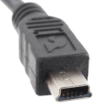

# To the Casio FX-97500GIII

You will need a USB-Mini-B (Not Micro-B) cable:

and enough space on the calculator's storage memory (this model has ~3 MB; this
project takes ~20 KB). Connect the calculator to the device with this project
and open the calculator as you would open a flash drive. Then copy the `src`
directory of this project to the root of the calculator (outside of `@MAINMEM`).

# To other calculators

The calculator needs:

- A Python interpreter
- A way to get files
- At least ~20 KB storage
- At least ~64 KB RAM
- The `Random` Python module

# To a computer running a mainstream OS

You only need a Python interpreter (this project was made for MicroPython) and
a terminal.
